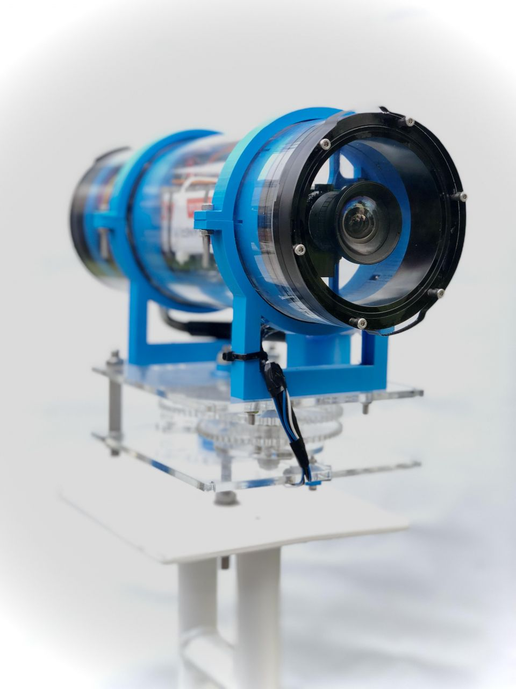

# An AI for KOSMOS
## 2021 Brest Ocean Hackathon

<p align="center">

</p>

### Installation


pre-requisites:
- python3 (Installation [link](https://www.python.org/downloads/))
- miniconda3 (Installation [link](https://docs.conda.io/en/latest/miniconda.html))

For the whole project, you need to create and use a virtual environment.  
You can use any version of python3 superior to 3.6. We recommend to use at least 3.9.

You can use any virtual environment manager, we personnally use miniconda3.

```console
conda create -n kosmos python=3.9
conda activate kosmos

conda install pytorch torchvision torchaudio cudatoolkit=11.1 -c pytorch -c conda-forge
pip install -r requirements.txt
```

### Training Detection

To train the model we used for detection, you need to launch the training script.  
You can find it in the `detection` folder.

If you want to use our detection model, you need to download the following [files](https://drive.google.com/drive/folders/1dZU5GKCDY4lboavcluMt2n9scUoRQnKJ) on our Drive.

### Testing

Both files `opencv_image.py` and `opencv_video.py` are provided to test classification
and detection models, respectively on a single image or a video.

### Classification

You can find the classifier model in the `classification` folder.
